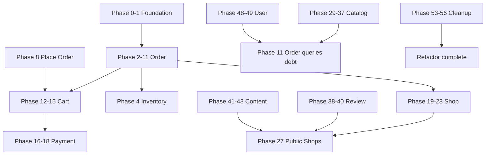

# Modular Monolith Refactor — Phased Plan

> **Scope:** `byte-forge-auth` only.  
> **Companion docs:** [architecture.md](./architecture.md) · [refactor-playbook.md](./refactor-playbook.md) · [cross-module-transactions.md](./cross-module-transactions.md)

This document is the **master phased plan** for the full refactor. Each phase has a **single purpose**, a **bounded scope**, and **explicit exit criteria**. Complete phases in order unless noted as parallel-safe.

**Global rules (every phase):**
- API routes and response contracts **unchanged**
- Existing e2e tests **must pass** before closing a phase
- No `db:generate` / `db:migrate` unless schema columns change
- No user session → JWT v2 migration
- Run before marking any phase done: `npx tsc --noEmit --incremental false`, `pnpm lint`, `pnpm test:e2e`

---

## Phase map (overview)

| Block | Phases | Purpose |
|-------|--------|---------|
| **A — Foundation** | 0–1 | Tooling, skeleton, shared types |
| **B — Order domain** | 2–11 | Highest-risk transactional flows first |
| **C — Cart** | 12–15 | Cart + wishlist |
| **D — Payment** | 16–18 | Payment methods + records |
| **E — Shop** | 19–28 | Largest legacy surface |
| **F — Catalog** | 29–37 | Products, plants, taxonomy |
| **G — Review** | 38–40 | Reviews across audiences |
| **H — Content** | 41–43 | Articles + campaigns |
| **I — Media** | 44 | Uploads |
| **J — Auth** | 45–47 | Auth structure only |
| **K — User** | 48–49 | Profile, addresses, admin users |
| **L — Platform & misc** | 50–52 | Location, notification, platform |
| **M — Cleanup** | 53–56 | Delete legacy roots, harden |

**Total: 57 phases (0–56)**

---

## Block A — Foundation

### Phase 0 — Baseline and module scaffolding

**Purpose:** Establish a verified baseline and create the empty `src/modules/` convention without moving behavior.

**Scope:**
- Create `src/modules/README.md` (one-paragraph pointer to architecture.md)
- Add path alias if needed (`@/modules/*`)
- Document baseline e2e pass in a short note (date + command output summary)
- No production code moves

**Exit criteria:**
- [x] `src/modules/` directory exists
- [x] `tsc`, `lint` pass with zero functional changes
- [ ] `e2e` pass — Jest path alias fixed; re-run with DB (see [refactor-baseline.md](./refactor-baseline.md))
- [x] Baseline documented in [refactor-baseline.md](./refactor-baseline.md)

---

### Phase 1 — Shared transaction types and ESLint guardrails

**Purpose:** Standardize cross-module `tx` patterns and prevent new boundary violations.

**Scope:**
- Move or re-export `DrizzleTx`, `TLockTransaction` to `src/libs/db/types/` (or document current paths)
- Add ESLint `no-restricted-imports`: block `@/_db/drizzle/schema` outside `**/repositories/**` and `_db/**`
- Update `.cursor/rules/modular-monolith.mdc` if paths change

**Exit criteria:**
- [x] `DrizzleTx` / `TLockTransaction` have one canonical import path documented in architecture.md (`@/libs/db/types`)
- [x] ESLint rule active — **`warn`** on `@/_db/drizzle/schema` outside repositories (106 legacy warnings tracked; fix during domain migration)
- [x] `tsc`, `lint` pass (0 errors)
- [x] No existing violations fixed (by design)

---

## Block B — Order domain (phases 2–11)

> Order is first because checkout/cancel/ship are the most transaction-sensitive flows (ADR-0001).

### Phase 2 — Order module skeleton and domain model

**Purpose:** Create `OrderModule` structure and domain entities without switching routes.

**Scope:**
- Create `src/modules/order/` (module, empty controllers folder, application/commands, application/queries, domain, repositories, dto, mappers)
- Add `domain/order-status.ts`, `domain/order.entity.ts`, `domain/order-group.entity.ts` (if needed)
- Port rules from `OrderStatusTransitionService` into entity methods
- Register `OrderModule` in `AppModule` (no controllers yet)

**Exit criteria:**
- [x] `OrderModule` imports/exports compile
- [x] Entity methods mirror existing transition rules (parity with `OrderStatusTransitionService` / ADR-0001)
- [x] Legacy `src/api/**/order*` still serves traffic
- [x] `tsc`, `lint` pass (0 errors)

---

### Phase 3 — Order repository migration (persistence only)

**Purpose:** Move `order.repository` into the module with row ↔ entity mapping; no route switch.

**Scope:**
- Copy `_repositories/user/order.repository/**` → `modules/order/repositories/order.repository.ts`
- Repository imports only `@/_db/drizzle/schema/order` (+ shipping tables if order-owned)
- Map `findById`, `save`, and other core methods to `Order` entity
- All write methods accept optional `{ tx, lock? }`
- Legacy repo remains; new repo wired in `OrderModule` only

**Exit criteria:**
- [x] New repository compiles and is injectable in `OrderModule`
- [x] Entity mapping for core methods (`getOrderById*`, `createOrder`, `updateOrder`, `save`, `createOrderGroup`)
- [x] No controller uses new repo yet
- [x] `tsc`, `lint` pass

---

### Phase 4 — Inventory module skeleton and `InventoryCommandService`

**Purpose:** Extract inventory reservation/release from `common/services/order/` into Inventory module public API **before** checkout refactor.

**Scope:**
- Create `src/modules/inventory/` (skeleton + `Inventory` entity)
- Move `_repositories/business/inventory.repository/**` → `modules/inventory/repositories/`
- Create `InventoryCommandService` with `reserveForOrder`, `releaseOrderReservation`, etc. (from `order-inventory.service.ts`)
- Export `InventoryCommandService` only
- `OrderModule` does not depend on it yet (or depends but unused)

**Exit criteria:**
- [x] `InventoryCommandService` methods accept required `tx` where called from transactions
- [x] `common/services/order/order-inventory.service.ts` still used by legacy checkout (parallel OK)
- [x] `InventoryRepository` not exported
- [x] `tsc`, `lint` pass

---

### Phase 5 — Order query services (read paths)

**Purpose:** Move order **read** logic into `application/queries/` without changing responses.

**Scope:**
- `get-orders.service.ts` → `get-buyer-orders.query.ts`
- `get-order-group.service.ts` → `get-order-group.query.ts`
- Admin list/detail → `list-admin-orders.query.ts`, `get-admin-order.query.ts`
- Seller list/detail → `list-seller-orders.query.ts`, `get-seller-order.query.ts`
- Move Drizzle from queries into `OrderRepository` (no `db.client` in queries)
- Cross-module reads via `CatalogQueryService` / `UserQueryService` stubs or direct repo only if target modules don't exist yet — document temporary exceptions

**Exit criteria:**
- [x] Query classes produce identical DTOs to legacy services (diff mappers if needed)
- [x] No `DrizzleService.client` in query classes
- [x] Legacy services delegate to new queries (adapter pattern); routes unchanged
- [x] `tsc`, `lint` pass — **e2e** re-run locally with DB

---

### Phase 6 — Buyer order commands (cancel, confirm delivery)

**Purpose:** Migrate lower-risk buyer **mutations** before place-order.

**Scope:**
- `cancel-order.service.ts` → `cancel-buyer-order.command.ts`
- `confirm-delivery.service.ts` → `confirm-delivery.command.ts`
- Commands use `Order` entity + `OrderRepository` + `InventoryCommandService` with `{ tx }`
- Wire `BuyerOrdersController` to new commands (same routes) OR legacy delegates

**Exit criteria:**
- [x] Cancel + confirm delivery use single transaction with inventory release where applicable
- [x] Status history + row lock preserved (buyer flows have no optimistic `updatedAt` check)
- [x] Legacy services delegate to commands; routes unchanged
- [x] `tsc`, `lint` pass — **e2e** re-run locally with DB/env

---

### Phase 7 — Seller order commands (status, ship, cancel)

**Purpose:** Migrate seller order mutations with same transactional guarantees.

**Scope:**
- `cancel-seller-order.service.ts`, `ship-seller-order.service.ts`, `update-seller-order-status.service.ts` → commands
- Preserve `seller-order-actions.util.ts` logic in domain or commands
- Wire `SellerOrdersController`

**Exit criteria:**
- [x] All seller status transitions go through `Order` entity rules
- [x] Row locks / stale update (`409`) preserved via `assertOrderNotStale`
- [x] Legacy services delegate to commands; routes unchanged
- [x] `tsc`, `lint` pass — **e2e** re-run locally with DB/env

---

### Phase 8 — Place order command (checkout)

**Purpose:** Migrate the highest-risk flow; fix order-number `tx` bug.

**Scope:**
- `place-order.service.ts` → `place-order.command.ts`
- `calculate-price-breakdown.service.ts` → query (can be separate small phase if needed)
- `checkout-payment-method.service.ts` → stays until Payment module (inject as today)
- All SQL in repos; `nextOrderNumber({ tx })` uses `getExecutor(tx)`
- `db.transaction` orchestrates: order group, orders, items, inventory reserve, cart clear
- Emit `OrderPlaced` after commit (same as today)

**Exit criteria:**
- [x] No `db.client` inside transaction callback (order numbers + group total use `{ tx }`)
- [x] Inventory reservation + order creation atomic in single transaction
- [x] Legacy `PlaceOrderService` delegates to `PlaceOrderCommand`; routes unchanged
- [x] `tsc`, `lint` pass — **e2e** re-run locally with DB/env

---

### Phase 9 — Order controllers cutover (buyer checkout + orders)

**Purpose:** Switch buyer-facing order HTTP layer to `modules/order/controllers/`.

**Scope:**
- Move `buyer-checkout.controller.ts`, `buyer-orders.controller.ts` to `modules/order/controllers/`
- Exact same `@Controller` paths and guards
- Remove legacy buyer checkout/orders from `src/api/`
- Update `AppModule` / remove from `UserApiModule`

**Exit criteria:**
- [x] No files under `src/api/user/buyer/checkout/` or `src/api/user/buyer/orders/`
- [x] Controllers on `OrderModule`; same paths, guards, and Swagger tags
- [x] Legacy thin services removed; controllers call queries/commands directly
- [x] `tsc`, `lint` pass — **e2e** re-run locally with DB/env

---

### Phase 10 — Order controllers cutover (seller + admin)

**Purpose:** Complete order HTTP migration for seller and admin audiences.

**Scope:**
- Move seller + admin order controllers to `modules/order/controllers/`
- Delete `src/api/user/seller/orders/`, `src/api/admin/orders/`
- Delete `_repositories/user/order.repository/`
- Delete `common/services/order/` (inventory already in Phase 4)

**Exit criteria:**
- [x] No legacy order API folders or order repository under `_repositories/`
- [x] Order query services exported from `OrderModule` for cross-module use (e.g. admin users)
- [x] Same controller paths, guards, and Swagger tags
- [x] `tsc`, `lint` pass — **e2e** re-run locally with DB/env

---

### Phase 11 — Order module hardening

**Purpose:** Close gaps and remove temporary adapters from order migration.

**Scope:**
- Remove any delegate/adapter legacy services
- Ensure `ListAdminOrdersQuery` uses `UserQueryService` + `CatalogQueryService` (implement stubs in catalog/user if not ready — see phases 48–49, 29–35)
- ESLint: zero new violations in `modules/order/`
- Update module README or inline docs for public exports

**Exit criteria:**
- [x] No imports from `src/api/**` or `_repositories/**` inside `modules/order/`
- [x] Cross-module reads documented (temporary vs final)
- [x] `tsc`, `lint` pass
- [ ] `e2e` pass (re-run locally with DB/env)

---

## Block C — Cart (phases 12–15)

### Phase 12 — Cart module skeleton and repository

**Purpose:** Move cart persistence into `modules/cart/`.

**Scope:**
- Create `modules/cart/`
- Move `cart.repository` from `_repositories/user/`
- Export `CartQueryService` + `CartCommandService` (skeleton)

**Exit criteria:**
- [x] Repository in module; optional `tx` on mutators
- [x] Legacy cart API still works
- [x] `tsc`, `lint` pass
- [ ] `e2e` pass (re-run locally with DB/env)

---

### Phase 13 — Cart query and read services

**Purpose:** Migrate cart read logic and `cart.service.ts` read paths.

**Scope:**
- Split `cart.service.ts` reads into queries
- `get-cart`, stock status helpers → repository or query
- No Drizzle in application layer

**Exit criteria:**
- [x] Cart GET endpoints unchanged
- [x] `tsc`, `lint` pass
- [ ] `e2e` pass (re-run locally with DB/env)

---

### Phase 14 — Cart mutation commands

**Purpose:** Migrate add/update/remove/merge/clear cart commands.

**Scope:**
- One command per legacy `services/*.service.ts` under buyer cart
- `CartAccessGuard` unchanged
- Transaction boundaries preserved for merge/bulk

**Exit criteria:**
- [x] All cart mutation logic in `modules/cart/application/commands/`
- [x] `place-order` uses `CartCommandService.removeOrderedItems(tx)` via integration
- [x] `tsc`, `lint` pass
- [ ] `e2e` pass (re-run locally with DB/env)

---

### Phase 15 — Cart controller cutover and wishlist

**Purpose:** Finish cart HTTP migration; include wishlist in cart module.

**Scope:**
- Move cart controller + module wiring
- Move `wishlist/**` + `wishlist.repository`
- Delete `src/api/user/buyer/cart/`, `wishlist/`, legacy repos

**Exit criteria:**
- [x] No legacy cart/wishlist under `src/api/`
- [x] `tsc`, `lint` pass
- [ ] `e2e` pass (re-run locally with DB/env)

---

## Block D — Payment (phases 16–18)

### Phase 16 — Payment module skeleton, entity, repository

**Purpose:** Establish payment domain with `Payment` entity.

**Scope:**
- `modules/payment/`
- Move `payment-method.repository`
- `Payment` entity for payment status transitions (COD)

**Exit criteria:**
- [x] Module compiles; `PaymentRepository` private
- [x] `tsc`, `lint` pass
- [ ] `e2e` pass (re-run locally with DB/env)

---

### Phase 17 — Admin payment methods

**Purpose:** Migrate admin CRUD for platform payment methods.

**Scope:**
- `admin/payment-methods/**` → `modules/payment/controllers/admin-payment-methods.controller.ts` + commands/queries
- Already split services — move as-is structure

**Exit criteria:**
- [x] Admin payment method routes unchanged
- [x] `tsc`, `lint` pass
- [ ] `e2e` pass (re-run locally with DB/env)

---

### Phase 18 — Public payment methods and checkout integration

**Purpose:** Complete payment module; wire checkout to `PaymentQueryService`.

**Scope:**
- `public/payment-methods/**` → payment module
- Refactor `checkout-payment-method.service` into payment module export
- Delete legacy payment API + repo paths

**Exit criteria:**
- [x] Checkout uses `PaymentModule` export only
- [x] No payment code under `src/api/`
- [x] `tsc`, `lint` pass
- [ ] `e2e` pass (re-run locally with DB/env)

---

## Block E — Shop (phases 19–28)

> Split because `shop.service.ts` is ~1064 lines and shop has 12+ repositories.

### Phase 19 — Shop module skeleton and `Shop` entity

**Purpose:** Create shop domain foundation.

**Scope:**
- `modules/shop/` structure
- `Shop` entity (verification state, publish rules)
- Register module

**Exit criteria:**
- [x] Entity reflects shop lifecycle rules
- [x] `tsc`, `lint` pass
- [ ] `e2e` pass (re-run locally with DB/env)

---

### Phase 20 — Core shop repository

**Purpose:** Move primary shop persistence.

**Scope:**
- `shop.repository` → `modules/shop/repositories/`
- Entity mapping for core shop row + translations

**Exit criteria:**
- [x] Core shop CRUD in new repo
- [x] Legacy still serves traffic
- [x] `tsc`, `lint` pass
- [ ] `e2e` pass (re-run locally with DB/env)

---

### Phase 21 — Seller shop profile commands (split 1/3)

**Purpose:** Extract first third of `shop.service.ts` — profile read/update.

**Scope:**
- Shop profile GET/PATCH seller routes
- Commands/queries only; no verification yet

**Exit criteria:**
- [x] Profile endpoints identical
- [x] No `db.client` in commands
- [x] `tsc`, `lint` pass
- [ ] `e2e` pass (re-run locally with DB/env)

---

### Phase 22 — Seller shop setup and social (split 2/3)

**Purpose:** Shop creation, setup, social links from `shop.service.ts`.

**Scope:**
- Setup shop, update social media, contact fields
- Coordinate `shop.address`, `shop.contact` repos into shop repository aggregate

**Exit criteria:**
- [x] Setup flow ports apply / contact / address into shop module
- [x] Transactions for multi-table shop setup preserved
- [x] `tsc`, `lint` pass
- [ ] `e2e` pass (re-run locally with DB/env)

---

### Phase 23 — Shop verification flow (split 3/3)

**Purpose:** Seller verification submit + admin moderation paths.

**Scope:**
- Seller verification from `shop.service.ts`
- `admin-shop.service.ts` → `modules/shop/controllers/admin-shops.controller.ts` (partial)
- `shop.verification.repository`, `shop.verification.history.repository`

**Exit criteria:**
- [x] Seller verification + admin approve/reject/suspend in shop module
- [x] `admin-shop.service.ts` deleted
- [x] `tsc`, `lint` pass
- [ ] `e2e` pass (re-run locally with DB/env)

---

### Phase 24 — Storefront submodule

**Purpose:** Move storefront content (profile, why choose us, value points).

**Scope:**
- `seller/storefront/**`, `shop-storefront.repository`
- Repo-owned transactions for multi-table writes

**Exit criteria:**
- [x] Storefront seller routes unchanged
- [x] `tsc`, `lint` pass
- [ ] `e2e` pass (re-run locally with DB/env)

---

### Phase 25 — Shipping rates

**Purpose:** Seller shipping rate configuration.

**Scope:**
- `seller/shipping-rates/**`, `shop.shipping-rates.repository`
- Order module continues to resolve rates via `ShopQueryService` or `ShippingRateQueryService` export

**Exit criteria:**
- [x] Shipping rate seller routes unchanged (`GET/PUT …/shipping-rates/my-shop`)
- [x] Place-order still resolves rates via `OrderRepository` (unchanged)
- [x] `tsc`, `lint` pass
- [ ] `e2e` pass (re-run locally with DB/env)

---

### Phase 26 — Shop follow (buyer)

**Purpose:** Move buyer shop-follow into shop module.

**Scope:**
- `buyer/shop-follow/**`, `shop-follow.repository`

**Exit criteria:**
- [x] Buyer follow routes unchanged (`GET following`, `POST/DELETE :slug/follow`)
- [x] `tsc`, `lint` pass
- [ ] `e2e` pass (re-run locally with DB/env)

---

### Phase 27 — Public shops read model

**Purpose:** Migrate public shop discovery and shop page queries.

**Scope:**
- `public/shops/**` (16 files) → queries composing catalog/review/order summaries
- Fix `PublicShopsModule` duplicate repo providers pattern
- No cross-module schema in queries

**Exit criteria:**
- [x] Public shop routes unchanged (`v1/shops/**`)
- [x] Batch ID fetches for list metrics (products, orders, reviews)
- [x] `ReviewRepository` via module import (no duplicate provider)
- [x] `tsc`, `lint` pass
- [ ] `e2e` pass (re-run locally with DB/env)

---

### Phase 28 — Shop cutover cleanup

**Purpose:** Delete legacy shop API and fragmented repos.

**Scope:**
- Remove `src/api/user/seller/shop/`, `admin-shop/`, `public/shops/`, related `_repositories/business/shop*`
- `shop.service.ts` and `admin-shop.service.ts` deleted
- Export `ShopQueryService` for catalog/order/public

**Exit criteria:**
- [x] No core shop code under `src/api/` (profile, admin, public, follow, storefront, shipping)
- [x] Fragment repos removed (`shop.address`, `shop.contact`, `shop.business`, `shop.manager`)
- [x] `ShopQueryService` exported for cross-module reads
- [x] Admin/lifecycle write paths use `Shop` entity
- [x] `tsc`, `lint` pass
- [ ] `e2e` pass (re-run locally with DB/env)

---

## Block F — Catalog (phases 29–37)

### Phase 29 — Catalog module skeleton and taxonomy repositories

**Purpose:** Own categories, tags, tag-groups (schema + repos).

**Scope:**
- `modules/catalog/`
- Move `library/taxonomy/*` repositories
- Export `CatalogQueryService` (stub)

**Exit criteria:**
- [x] Taxonomy repos under `modules/catalog/repositories/`
- [x] `CatalogQueryService` stub exported
- [x] Legacy `_repositories/library/taxonomy/` removed
- [x] `tsc`, `lint` pass
- [ ] `e2e` pass (re-run locally with DB/env)

---

### Phase 30 — Admin taxonomy (categories)

**Purpose:** Migrate largest taxonomy admin surface.

**Scope:**
- `admin-taxonomy/categories/**` → catalog module admin controllers
- Split `admin-categories.service.ts` (575 lines) into commands/queries

**Exit criteria:**
- [ ] Admin category CRUD e2e pass
- [ ] No `db.client` in application layer
- [ ] `tsc`, `lint`, `e2e` pass

---

### Phase 31 — Admin taxonomy (tags and tag groups)

**Purpose:** Complete admin taxonomy migration.

**Scope:**
- Tag groups + tags + translation services

**Exit criteria:**
- [ ] Admin tag/group e2e pass
- [ ] `tsc`, `lint`, `e2e` pass

---

### Phase 32 — Public categories and tags

**Purpose:** Public taxonomy reads.

**Scope:**
- `public/categories/`, `public/tags/`

**Exit criteria:**
- [ ] Public taxonomy routes unchanged
- [ ] `tsc`, `lint`, `e2e` pass

---

### Phase 33 — Seller products (read-heavy)

**Purpose:** Migrate seller product list/overview/summary/get-by-id.

**Scope:**
- `seller/products/**` read services
- Drizzle → catalog repository

**Exit criteria:**
- [ ] Seller product read e2e pass
- [ ] `tsc`, `lint`, `e2e` pass

---

### Phase 34 — Seller plants (create + update)

**Purpose:** Migrate largest plant services (680–829 lines).

**Scope:**
- `create-plant.service.ts`, `update-plant.service.ts` → commands
- Multi-table plant create in catalog repository transaction

**Exit criteria:**
- [ ] Plant create/update e2e pass
- [ ] Transaction boundaries preserved
- [ ] `tsc`, `lint`, `e2e` pass

---

### Phase 35 — Seller plants (status, delete, get) + admin products

**Purpose:** Finish seller plants + admin product oversight.

**Scope:**
- Remaining plant services
- `admin/products/**`

**Exit criteria:**
- [ ] Plant delete/status e2e pass
- [ ] Admin products routes work
- [ ] `tsc`, `lint`, `e2e` pass

---

### Phase 36 — Public plants (library)

**Purpose:** Migrate public plant list and PDP (505/454 line services).

**Scope:**
- `public/plants/**` → queries + `CatalogQueryService`

**Exit criteria:**
- [ ] Public plant list/slug e2e pass
- [ ] `tsc`, `lint`, `e2e` pass

---

### Phase 37 — Catalog cutover cleanup

**Purpose:** Delete legacy catalog API and taxonomy repos from old paths.

**Scope:**
- Remove `src/api/**/plants`, `products`, `categories`, `tags`, `admin-taxonomy`, `admin/products`
- Remove `_repositories/library/taxonomy`
- `CatalogQueryService.getProductSummaries(ids)` stable for order module

**Exit criteria:**
- [ ] Order module uses `CatalogQueryService` (Phase 11 debt closed)
- [ ] No catalog code under `src/api/` or `_repositories/library/`
- [ ] `tsc`, `lint`, `e2e` pass

---

## Block G — Review (phases 38–40)

### Phase 38 — Review module skeleton and repository

**Purpose:** Move 747-line `review.repository` into module.

**Scope:**
- `modules/review/` + repository + entity if needed

**Exit criteria:**
- [ ] Repository with entity mapping compiles
- [ ] `tsc`, `lint`, `e2e` pass

---

### Phase 39 — Buyer and seller review surfaces

**Purpose:** Migrate user-facing review write/read.

**Scope:**
- `buyer/reviews/`, `seller/reviews/`

**Exit criteria:**
- [ ] Review create/report/respond e2e pass
- [ ] `tsc`, `lint`, `e2e` pass

---

### Phase 40 — Public and admin reviews cutover

**Purpose:** Complete review domain migration.

**Scope:**
- `public/reviews/`, `admin/reviews/`
- Delete legacy review API + repo

**Exit criteria:**
- [ ] No review code under `src/api/` or old repo path
- [ ] `tsc`, `lint`, `e2e` pass

---

## Block H — Content (phases 41–43)

### Phase 41 — Content module and articles

**Purpose:** Migrate shop articles (seller + admin + public list).

**Scope:**
- `shop-article.repository`, seller/admin articles
- Public article lists (from public shops or here)

**Exit criteria:**
- [ ] Article CRUD + moderation e2e pass
- [ ] `tsc`, `lint`, `e2e` pass

---

### Phase 42 — Campaigns

**Purpose:** Migrate shop campaigns.

**Scope:**
- `shop-campaign.repository`, seller/admin campaigns

**Exit criteria:**
- [ ] Campaign e2e pass
- [ ] `tsc`, `lint`, `e2e` pass

---

### Phase 43 — Content cutover cleanup

**Purpose:** Delete legacy content API and repos.

**Exit criteria:**
- [ ] No article/campaign code under `src/api/`
- [ ] `tsc`, `lint`, `e2e` pass

---

## Block I — Media (phase 44)

### Phase 44 — Media module migration

**Purpose:** Unify shared `api/media` and `admin/media`.

**Scope:**
- `media.repository`, `media.service`, both controllers → `modules/media/`

**Exit criteria:**
- [ ] Upload/delete e2e pass (user + admin)
- [ ] No media under `src/api/`
- [ ] `tsc`, `lint`, `e2e` pass

---

## Block J — Auth (phases 45–47)

> Structure only — no session → JWT v2 behavior change.

### Phase 45 — User auth module structure

**Purpose:** Move user auth into `modules/auth/` without changing auth behavior.

**Scope:**
- `user-auth/`, `password-reset/`
- Auth repos: `user-session-repository`, `user.local.auth`, etc.
- Keep `UserAuthGuard` behavior identical

**Exit criteria:**
- [ ] Login/logout/profile auth e2e pass
- [ ] No JWT v2 cutover
- [ ] `tsc`, `lint`, `e2e` pass

---

### Phase 46 — Admin auth and session

**Purpose:** Move admin auth + session.

**Scope:**
- `admin-auth/`, `admin-session/`
- Admin repos under `modules/auth/`

**Exit criteria:**
- [ ] Admin login/session e2e pass
- [ ] `tsc`, `lint`, `e2e` pass

---

### Phase 47 — Auth dead code cleanup

**Purpose:** Remove duplicate/orphan auth repos.

**Scope:**
- Delete `_repositories/user/user.session.repository/` (orphan)
- Document dual JWT v2 as future work

**Exit criteria:**
- [ ] No duplicate session repository
- [ ] `tsc`, `lint`, `e2e` pass

---

## Block K — User (phases 48–49)

### Phase 48 — User profile and addresses

**Purpose:** Migrate profile + buyer addresses.

**Scope:**
- `user/user/`, `buyer/addresses/`
- `user.repository`, `user-address.repository`

**Exit criteria:**
- [ ] Profile + address e2e pass
- [ ] `UserQueryService.getUserSummaries(ids)` exported
- [ ] `tsc`, `lint`, `e2e` pass

---

### Phase 49 — Admin users cutover

**Purpose:** Complete user domain.

**Scope:**
- `admin/users/**`
- Delete legacy user API/repos

**Exit criteria:**
- [ ] Admin user management e2e pass
- [ ] Order admin queries use `UserQueryService` (debt closed)
- [ ] `tsc`, `lint`, `e2e` pass

---

## Block L — Platform & misc (phases 50–52)

### Phase 50 — Location module

**Purpose:** Small, self-contained public location API.

**Scope:**
- `public/location/**` → `modules/location/`

**Exit criteria:**
- [ ] Location routes unchanged
- [ ] `tsc`, `lint`, `e2e` pass

---

### Phase 51 — Notification module extraction

**Purpose:** Centralize event-driven email/notifications currently scattered in order/shop.

**Scope:**
- `libs/` or `modules/notification/` listeners
- No behavior change — move only

**Exit criteria:**
- [ ] Order/shop commands emit same events
- [ ] Email flows e2e or smoke-tested
- [ ] `tsc`, `lint`, `e2e` pass

---

### Phase 52 — Platform module (health, i18n, analytics)

**Purpose:** Cross-cutting platform endpoints.

**Scope:**
- Health (already outside api prefix)
- `admin-i18n/languages/`
- `seller/analytics/` → shop or platform (document choice)

**Exit criteria:**
- [ ] Health + languages + analytics work
- [ ] `tsc`, `lint`, `e2e` pass

---

## Block M — Cleanup (phases 53–56)

### Phase 53 — `common/` → `libs/` rename

**Purpose:** Infrastructure folder matches architecture.

**Scope:**
- Rename `src/common/` → `src/libs/` (or gradual alias)
- Update all imports
- No domain logic left in libs

**Exit criteria:**
- [ ] No `src/common/` directory
- [ ] Guards, email, drizzle, events under `src/libs/`
- [ ] `tsc`, `lint`, `e2e` pass

---

### Phase 54 — Delete `src/api/`

**Purpose:** Remove empty/legacy API root.

**Scope:**
- Verify `src/api/` has no remaining `.ts` files (except maybe README)
- Remove `UserApiModule`, `AdminApiModule`, `PublicApiModule` aggregators
- `AppModule` imports domain modules directly

**Exit criteria:**
- [ ] `src/api/` deleted or documentation-only
- [ ] `tsc`, `lint`, `e2e` pass

---

### Phase 55 — Delete `src/_repositories/`

**Purpose:** Remove global repository folder.

**Scope:**
- Verify all repos live under `src/modules/{domain}/repositories/`
- Delete `_repositories/` and `_types/lock.transaction` (moved to libs)

**Exit criteria:**
- [ ] No `src/_repositories/` directory
- [ ] `tsc`, `lint`, `e2e` pass

---

### Phase 56 — Final enforcement and sign-off

**Purpose:** Harden boundaries and close the refactor.

**Scope:**
- ESLint `no-restricted-imports` → **error** with zero violations
- Audit all modules export only query/command services
- Update `architecture.md` / playbook with "refactor complete" note
- Full e2e + manual smoke checklist (checkout, cancel, ship, verification)

**Exit criteria:**
- [ ] Zero ESLint boundary violations
- [ ] All 14 domain modules under `src/modules/`
- [ ] Full `tsc`, `lint`, `e2e` pass
- [ ] No imports from `@/api/*` or `@/_repositories/*` anywhere in codebase
- [ ] Refactor signed off

---

## Dependency diagram (simplified)



---

## Per-phase PR checklist (copy into every PR)

```markdown
## Phase N — [title]

### Exit criteria
- [ ] tsc
- [ ] lint
- [ ] e2e
- [ ] No API route changes
- [ ] No new migrations
- [ ] Phase-specific criteria (from refactor-phases.md)

### Notes
- Temporary cross-module exceptions:
- Deferred debt:
```

---

## Estimated effort (rough)

| Block | Phases | Relative size |
|-------|--------|---------------|
| A Foundation | 2 | Small |
| B Order | 10 | Large |
| C Cart | 4 | Medium |
| D Payment | 3 | Small |
| E Shop | 10 | Very large |
| F Catalog | 9 | Very large |
| G Review | 3 | Medium |
| H Content | 3 | Medium |
| I Media | 1 | Small |
| J Auth | 3 | Medium |
| K User | 2 | Medium |
| L Platform | 3 | Small |
| M Cleanup | 4 | Medium |

**Order matters for risk reduction, not because shop is smaller.** Shop and catalog are the largest remaining efforts after order/cart/payment.

---

## When to update this document

- Add a sub-phase if a single phase exceeds ~3–5 PRs or touches >15 files with mixed concerns
- Split controller cutover from command migration if e2e fails mid-phase
- Record completed phase dates in a table at the bottom as you go

### Completion log

| Phase | Status | Date | Notes |
|-------|--------|------|-------|
| 0 | Done | 2026-08-11 | `src/modules/README.md`, `@/modules/*` alias, baseline doc, jest e2e path fix |
| 1 | Done | 2026-08-11 | `@/libs/db/types`, ESLint schema guard (106 warnings), `src/libs/README.md` |
| 2 | Done | 2026-08-11 | `modules/order` skeleton, domain entities + policy, `OrderModule` in AppModule |
| 3 | Done | 2026-08-11 | `OrderRepository` in module with entity mapping; legacy repo unchanged |
| 4 | Done | 2026-08-11 | `InventoryModule` + `InventoryCommandService`; legacy order-inventory unchanged |
| 5 | | | |
