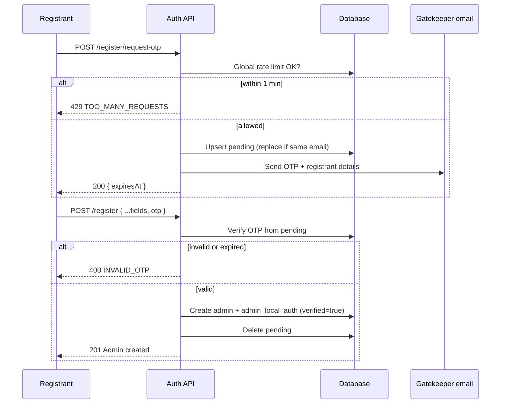

# Admin registration OTP plan

**Status:** Phases 1–7 implemented (backend + admin UI register flow).

## Overview

Replace the open `POST /v1/admin/auth/register` flow with a **two-step, OTP-gated** registration:

1. **Request OTP** — registrant submits profile + credentials; system sends a 6-digit OTP to a **gatekeeper email** from env (not the registrant’s email).
2. **Complete registration** — registrant submits the same payload plus OTP; account is created only after OTP verification.

This protects admin creation without requiring an existing superadmin session.

---

## Requirements (confirmed)

| Rule | Detail |
|------|--------|
| OTP recipient | `ADMIN_REGISTRATION_OTP_EMAIL` (env) — gatekeeper inbox, not registrant |
| Rate limit | **Global** max **1 OTP request per minute** (entire platform) |
| No resend endpoint | To get a new code, call request-otp again (subject to rate limit) |
| Replace pending attempt | Same unverified `email` on a new request **replaces** the previous pending row + OTP |
| Gatekeeper email content | Include registrant `email`, `userName`, `firstName` / `lastName` |
| Verified flag | Set `admin_local_auth.verified = true` on successful completion |

---

## Current state (baseline)

| Area | Today |
|------|--------|
| Endpoint | `POST /v1/admin/auth/register` — public, no guard |
| Swagger | Says “superadmin only” but **nothing enforces it** |
| Validation | `CreateLocalAdminDto` only (`firstName`, `lastName`, `userName`, `email`, `password`) |
| OTP | None |
| Rate limit | None |
| `admin_local_auth.verified` | Column exists (field typo: `verfied` in schema) but is never set on register |

**Do not reuse** `OtpService` / `otpTable` — those are tied to `userTable.id`. Admin registration happens **before** an admin row exists.

---

## Target API

| Method | Path | Rate limit | Body |
|--------|------|------------|------|
| `POST` | `/v1/admin/auth/register/request-otp` | Global 1/min | `CreateLocalAdminDto` |
| `POST` | `/v1/admin/auth/register` | None | `CreateLocalAdminDto` + `otp` |

### Response shapes

**Request OTP (200)**

```json
{
  "message": "Admin registration OTP sent",
  "data": { "expiresAt": "2026-08-14T03:17:00.000Z" }
}
```

OTP is never returned in the API response.

**Complete registration (201)**

Same success shape as today’s register (admin profile, no secrets).

**Rate limited (429)**

```json
{
  "errorCode": "TOO_MANY_REQUESTS",
  "message": "..."
}
```

---

## Flow



---

## Phase 1 — Data model and config

**Owner:** schema files only. **You** run `db:generate` and `db:migrate`.

### 1.1 Table: `admin_registration_pending`

Stores in-flight registrations before the admin row exists.

| Column | Type | Notes |
|--------|------|-------|
| `id` | UUID PK | `defaultRandom()` |
| `email` | varchar(255) | **Unique** — replacement key for unverified retries |
| `user_name` | varchar(50) | Unique at request time (check `admins` table) |
| `first_name` | varchar(50) | |
| `last_name` | varchar(50) | |
| `hashed_password` | varchar(255) | Hash at request time; never store plaintext |
| `hashed_otp` | varchar(255) | Hashed 6-digit OTP |
| `expires_at` | timestamptz | Reuse `OTP_EXPIRY_MINUTES` (5) |
| `created_at` | timestamptz | `defaultNow()` |

**File:** `src/_db/drizzle/schema/admin/admin-registration-pending.schema.ts`

**Export** from `src/_db/drizzle/schema/admin/index.ts`.

### 1.2 Table: `admin_registration_rate_limit`

Singleton row for global throttle.

| Column | Type | Notes |
|--------|------|-------|
| `id` | varchar PK | Fixed value `'global'` |
| `last_otp_sent_at` | timestamptz | Updated only when an OTP email is actually dispatched |

**File:** `src/_db/drizzle/schema/admin/admin-registration-rate-limit.schema.ts`

Seed the `'global'` row in app migration or on first use (upsert in repository).

### 1.3 Environment

Add required env var:

```env
ADMIN_REGISTRATION_OTP_EMAIL=ops@example.com
```

**Files to update:**

- `src/_config/env.schema.ts`
- `src/libs/modules/app-config/app-config.service.ts`
- `.env.example`
- `.env.staging.example`
- `scripts/deploy.env.template` (if used)

### 1.4 Deliverable

Schema committed; migration generated and applied locally by maintainer.

---

## Phase 2 — Domain services

**Scope:** Business logic, no HTTP yet.

### 2.1 `AdminRegistrationPendingRepository`

| Method | Behavior |
|--------|----------|
| `upsertPendingRegistration(...)` | Replace row by `email` (delete + insert or `onConflictDoUpdate`) |
| `findByEmail(email)` | Load pending row |
| `deleteByEmail(email)` | After successful registration |
| `verifyOtp(email, otp)` | Compare hash, check `expires_at`; throw `INVALID_OTP` if wrong/expired |

### 2.2 `AdminRegistrationRateLimiterService`

| Method | Behavior |
|--------|----------|
| `assertCanSendOtp()` | If `last_otp_sent_at > now - 1 minute` → `429 TOO_MANY_REQUESTS` |
| `recordOtpSent()` | Set `last_otp_sent_at = now()` |

Run rate-limit check and `recordOtpSent` in the **same transaction** as pending upsert so a failed email does not consume the slot (or record only after successful event emit — pick one and test).

### 2.3 `AdminRegistrationService`

**`requestRegistrationOtp(payload, lang)`**

1. Reject if `email` already exists in `admin_local_auth`.
2. Reject if `userName` already exists in `admins`.
3. `assertCanSendOtp()` — global rate limit.
4. Hash `password`; generate OTP; hash OTP.
5. Upsert `admin_registration_pending` (replaces prior attempt for same email).
6. `recordOtpSent()`.
7. Emit `AdminRegistrationOtpEmailSendEvent` to `ADMIN_REGISTRATION_OTP_EMAIL` with registrant details + OTP.

**`completeRegistration(payload with otp, lang)`**

1. Load pending row by `email`.
2. If missing → `NOT_FOUND` or generic invalid OTP (avoid email enumeration if desired).
3. Verify OTP; on failure → `INVALID_OTP`.
4. Transaction:
   - `adminService.createAdmin(...)`
   - `adminLocalAuthService.createAdminLocalAuth(...)` with **`verified: true`**
   - Delete pending row.
5. Return admin profile (same as current `register`).

### 2.4 Refactor `AdminAuthService`

- Remove or privatize the current one-shot `register()`.
- Delegate to `AdminRegistrationService` from controller.

### 2.5 Deliverable

Repository + services; unit tests for rate limiter and pending replace/verify.

**Suggested test file locations:**

- `admin-registration-rate-limiter.service.spec.ts`
- `admin-registration.service.spec.ts`

---

## Phase 3 — HTTP API

**Scope:** Controller, DTOs, Swagger.

### 3.1 DTOs

| DTO | Fields |
|-----|--------|
| `CreateLocalAdminDto` | Unchanged |
| `CompleteAdminRegistrationDto` | `CreateLocalAdminDto` + `otp` (6 digits, same rules as `VerifyEmailDto`) |

**Files:**

- `controllers/dto/create.local.admin.dto.ts` (unchanged)
- `controllers/dto/complete.local.admin.dto.ts` (new)

### 3.2 Controller (`AdminAuthController`)

- `POST register/request-otp` → `requestRegistrationOtp`
- `POST register` → `completeRegistration` (requires `otp`)
- Remove direct one-shot register behavior
- Update Swagger descriptions (drop misleading “superadmin only” unless a real guard is added later)

### 3.3 Module wiring

Register in `auth.module.ts`:

- `AdminRegistrationPendingRepository`
- `AdminRegistrationRateLimiterService`
- `AdminRegistrationService`

### 3.4 Deliverable

Working API; manual test via Swagger or curl.

---

## Phase 4 — Email pipeline

### 4.1 Template

| Piece | Path / id |
|-------|-----------|
| Template id | `EmailTemplateId.AUTH_ADMIN_REGISTRATION_OTP` |
| Template | `templates/auth/admin-registration-otp.template.ts` |
| Copy (EN/BN) | `copy/auth/admin-registration-otp.json` |
| Registry | `email-template.registry.ts` |

**Interpolation args:** `otp`, `minutes`, `registrantEmail`, `registrantUserName`, `registrantName`

### 4.2 Event and listener

**Event:** `AdminRegistrationOtpEmailSendEvent`  
**Channel:** `email.admin-registration-otp.send`

**Listener:** `EmailDispatchListener.handleAdminRegistrationOtpEmail`  
**Service method:** `EmailService.sendAdminRegistrationOtpEmail(...)`

### 4.3 i18n API messages

Add to `src/i18n/en/message.json` and `src/i18n/bn/message.json`:

- Rate limited (`429`)
- Pending not found / OTP invalid / expired
- Email or username already exists (if not already covered)

### 4.4 Deliverable

Console provider logs OTP email in dev; SMTP in staging/prod.

---

## Phase 5 — Tests and hardening

| Test case | Expected |
|-----------|----------|
| Global rate limit | Second request within 60s → `429`, even with different email |
| Replace pending | Same email twice (after 60s) → only latest OTP works |
| Happy path | Request → verify → admin created, pending cleared, `verified: true` |
| Duplicate email | Email already in `admin_local_auth` → conflict on request-otp |
| Duplicate username | Username in `admins` → conflict on request-otp |
| Expired OTP | Reject; user must request again (after rate limit) |
| Invalid OTP | `INVALID_OTP`; pending row remains until replaced or expired |

Optional: DB integration test if project pattern supports it.

---

## Phase 6 — Ops and docs

- Set `ADMIN_REGISTRATION_OTP_EMAIL` in each environment.
- Run `npm run db:generate` and `npm run db:migrate` after Phase 1 schema.
- Smoke test: request-otp → check gatekeeper inbox → complete with OTP.
- Update `API_DOCUMENTATION.md` when endpoints ship.

---

## Phase 7 — Admin frontend (deferred)

Only if `byte-forge-admin` needs a register screen:

1. Step 1 form → `POST /register/request-otp`
2. Step 2 OTP field → `POST /register`
3. Handle `429` with “try again in ~60 seconds” (global limit)

Not required for backend MVP if registration is API-only.

---

## Implementation order

| Phase | Effort | Blocked by |
|-------|--------|------------|
| 1 — Schema and env | Small | — |
| 2 — Services | Medium | Phase 1 migrated |
| 3 — API | Small | Phase 2 |
| 4 — Email | Small | Phase 2 |
| 5 — Tests | Medium | Phases 2–4 |
| 6 — Ops | Small | Phase 1 migrate |
| 7 — Frontend | Optional | Phase 3 |

Phases 3 and 4 can run in parallel after Phase 2.

---

## Out of scope

- Superadmin session required to create admins
- Per-IP rate limiting (requirement is **global**)
- Dedicated OTP resend endpoint
- Fixing `verfied` column typo in `admin.local.auth.schema.ts` (cosmetic; set field correctly on complete)
- Payment or subscription gates on admin creation

---

## Security notes

- Pending table holds **hashed** password and OTP only.
- Gatekeeper email is the approval mechanism — protect that inbox.
- Global 1/min limits OTP spam to gatekeeper and DB writes.
- Re-registration for same email invalidates the previous OTP immediately (on successful rate-limited request).
- Consider uniform error messages on complete step to reduce email enumeration (product decision).

---

## Related files (today)

| File | Role |
|------|------|
| `modules/auth/controllers/admin-auth.controller.ts` | Current open register |
| `modules/auth/application/admin-auth.service.ts` | One-shot `register()` |
| `modules/auth/controllers/dto/create.local.admin.dto.ts` | Registration payload |
| `libs/modules/otp/otp.service.ts` | User OTP only — **not** reused |
| `_db/drizzle/schema/admin/admin.local.auth.schema.ts` | `verified` flag |
